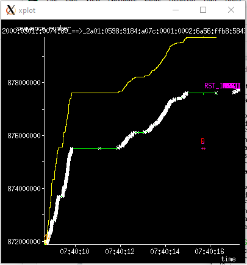

# tcptrace-6.6.7_tmo1

This is a fork of tcptrace-6.6.7 by Shawn Ostermann as obtained from
[http://tcptrace.org/download/tcptrace-6.6.7.tar.gz](http://tcptrace.org/download/tcptrace-6.6.7.tar.gz). It
contains several improvements I've added over the past years to
support my work as an end-to-end network optimisation engineer at
Deutsche Telekom AG.

I cannot stress enough how useful this tool has been to me over the
past decade. So I would like to give my improvements back to the
community. The notable changes are:

* Support for traces captured on a 3G Gn, LTE S1-U or 5GSA N3
interface (i.e. stripping the outer IP/UDP/GTP header and performing
the analysis on the inner IP header)

* Increased the internal timestamp granularity from microseconds to nanoseconds.

* Removed the dependency of the libpcap library. In order to build a
  tiny executable that runs x86 as well as on Android platforms,
  reading and parsing of .pcap files has been reimplemented. Linking
  to libpcap is not necessary anymore.

* Support of reading .pcapng files

* Support of reading Microsoft Network Monitor 3.4 (Netmon) files. (At
times, Netmon was the only reliable way of capturing mobile broadband
packet traces)

* Support of several previously unsupported link-layer types that came
  across during the past years.

* When used with `tcptrace -l` added the minimum and maximum
throughput of 1-, 2-, 5- and 10-second intervals as fields
`tp_min_1s`, `tp_min_2s`, `tp_min_5s`, `tp_min_10s`, `tp_max_1s`,
`tp_max_2s`, `tp_max_5s`, `tp_max_10s`.

* Added a Python wrapper `ttraces.py` that invokes `tcptrace -S
--xplot_all_files ...` and saves a lot of typing when analysing trace
files.


## ttraces.py

`ttraces.py` is a Python wrapper around `tcptrace` that simplifies the
analysis of packet traces using tcptrace time-sequence plots.

### ttraces.py FILE_NAME

Invoking `ttraces.py` just with a trace file as argument provides a
list of TCP connections in the trace file (just like `tcptrace -n`):

```
$ ttraces.py trace.pcap 

-------- trace.pcap --------
  1: Fri Oct 18 07:40:07.140816000 2 2a01:0598:9184:a07c:0001:0002:6a56:ffb8:48908 - 2a01:0488:2000:0301::0074:443 (a2b)              1>    1< 
  2: Fri Oct 18 07:40:08.603615000 2 2a01:0598:9184:a07c:0001:0002:6a56:ffb8:58432 - 2a01:0488:2000:0301::0074:80 (c2d)            1588> 4108< 
  3: Fri Oct 18 07:40:08.604799000 2 2a01:0598:9184:a07c:0001:0002:6a56:ffb8:58434 - 2a01:0488:2000:0301::0074:80 (e2f)            1520> 4019< 
  4: Fri Oct 18 07:40:08.604921000 2 2a01:0598:9184:a07c:0001:0002:6a56:ffb8:58436 - 2a01:0488:2000:0301::0074:80 (g2h)            2342> 3728< 
  5: Fri Oct 18 07:40:08.604936000 2 2a01:0598:9184:a07c:0001:0002:6a56:ffb8:58438 - 2a01:0488:2000:0301::0074:80 (i2j)            1652> 3378< 
  6: Fri Oct 18 07:40:08.606123000 2 2a01:0598:9184:a07c:0001:0002:6a56:ffb8:58440 - 2a01:0488:2000:0301::0074:80 (k2l)            2241> 3758< 
  7: Fri Oct 18 07:40:08.901740000 2 2a03:2880:f02d:0012:face:b00c::0003:443 - 2a01:0598:9184:a07c:0001:0002:6a56:ffb8:45744 (m2n)    4>    2< 
  8: Fri Oct 18 07:40:13.646171000 2 2a03:2880:f0ff:001a:face:b00c::0003:443 - 2a01:0598:9184:a07c:0001:0002:6a56:ffb8:56766 (o2p)    8>   11< 
  9: Fri Oct 18 07:40:14.305444000 2 2a03:2880:f22d:00c4:face:b00c::43fe:443 - 2a01:0598:9184:a07c:0001:0002:6a56:ffb8:47186 (q2r)    7>   11< 
 10: Fri Oct 18 07:40:14.318456000 2 2a03:2880:f0ff:001a:face:b00c::0003:443 - 2a01:0598:9184:a07c:0001:0002:6a56:ffb8:56780 (s2t)    8>   11< 
```

### ttraces.py *FILE_NAME* *CONN_NUMBER*

Adding a TCP connection number (e.g. 10) as second argument will
display a TCP time-sequence plot (similar to `tcptrace -n -S -o10
--xplot_all_files`) and display it using `xplot`:

```$ ttraces.py trace.pcap 2
1 arg remaining, starting with 'trace.pcap'
Ostermann's tcptrace -- version 6.6.7 -- Thu Nov  4, 2004

28408 packets seen, 28398 TCP packets traced
elapsed wallclock time: 0:00:00.135518000, 209625 pkts/sec analyzed
trace file elapsed time: 0:00:10.148098999
TCP connection info:
  2: 2a01:0598:9184:a07c:0001:0002:6a56:ffb8:58432 - 2a01:0488:2000:0301::0074:80 (c2d) 1588> 4108<  (reset)
xplot c2d_tsg.xpl d2c_tsg.xpl 
```

The `xplot` window will look like this:



### ttraces.py *FILE_NAME* /*PATTERN*

The same could also be accomplished by specifying `/` followed by a substring pattern that matches a line of the output of 
`tcptrace -n`, e.g. `/58432` would match TCP connection #2 as well (as one of the TCP ports is 58432).

```
$ ttraces.py trace.pcap /58432
1 arg remaining, starting with 'trace.pcap'
Ostermann's tcptrace -- version 6.6.7 -- Thu Nov  4, 2004

28408 packets seen, 28398 TCP packets traced
elapsed wallclock time: 0:00:00.108195000, 262562 pkts/sec analyzed
trace file elapsed time: 0:00:10.148098999
TCP connection info:
  2: 2a01:0598:9184:a07c:0001:0002:6a56:ffb8:58432 - 2a01:0488:2000:0301::0074:80 (c2d) 1588> 4108<  (reset)
xplot c2d_tsg.xpl d2c_tsg.xpl 
```
### ttraces.py *FILE_NAME* +max

Use `ttraces.py trace.pcap +max` to show a time-sequence plot of the TCP connection in the trace file having the most packets.

### ttraces.py *FILE_NAME* +

Use `ttraces.py trace.pcap +` to show a time-sequence plots of all TCP connections in the trace file in descending order of
the amount of their packets.

Wed July 14, 2021

Wolfgang Hansmann (wolfgang.hansmann@telekom.de)

# Original tcptrace-6.6.7 README file

```

Fri May 25, 2001

Shawn Ostermann
ostermann@cs.ohiou.edu

tcptrace is a TCP connection analysis tool.  It can tell you detailed
information about TCP connections by sifting through dump files.  The
dump file formats supported are:
   Standard tcpdump format (you need the pcap library)
   Sun's snoop format
   Macintosh Etherpeek format
   HP/NetMetrix protocol analysis format
   NS simulator output format
   NetScout
   NLANR Tsh Format

To see the graphs, you'll also need Tim Shepard's xplot program,
available at http://www.xplot.org

I've switched to using "./configure" to set up the Makefile.  That
seems to have eased portability problems a great deal.  Just say
"./configure" and then "make" to build the program.

Most of the rest of the Docs are on the web.  Check out:
  http://www.tcptrace.org/

Supported Platforms
-------------------

The program is developed here at OU on Sparc machines running Solaris
8.  Our intention is that it also run under common Unix variants.  In
particular, we try to test each release on the following platforms:
  NetBSD	
  FreeBSD	
  Linux		
  Darwin/OSX (Mac)
  Tru64 (Alpha)

We appreciate feedback and fixes on these or other platforms and will
attempt to modify the program to work on other platforms if we can get
enough help from people with access to those platforms and the changes
are not too "esthetically disagreeable".

Running the program
-------------------

Some simple examples:

0) What are the args and what do they mean???
     tcptrace 

1) Run the program quickly over a dump file
     tcptrace dumpfile

2) Get longer output
     tcptrace -l dumpfile

3) Generate lots of pretty plot files (you need xplot to see them)
     tcptrace -G dumpfile

4) Print the segment contents as you go
     tcptrace -p dumpfile

5) Print progress info (useful for large files)
     tcptrace -t dumpfile

Of course, you can chain arguments together until you get just what
you want.  


Let me know what you think....

Shawn
```